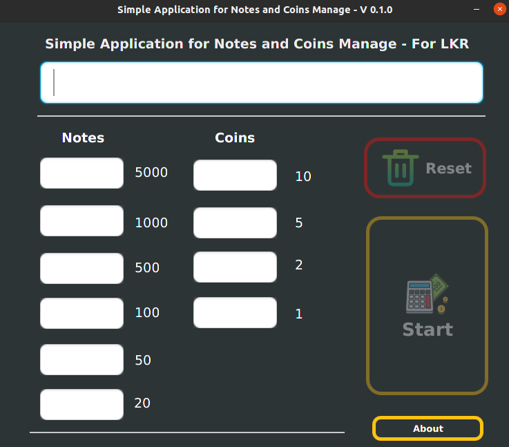

##Simple Application for Notes and Coins Manage - V 0.1.0 (For LKR)
##Overview

This small application is able to select the minimum notes and coins requirement for a given amount. The process of selecting is matched with the set of contemporary (application developed period) notes and coins of LKR - Sri Lanka.

The entire program was developed through Java programming language with performing Java FX API and the objective of the development is directed to educational purpose with included enhance the fundamental programming skills regards Java programming language and Java FX API.

The project has been licensed as an MIT license and open source project.

##Key highlights

This application is able to find out the minimum quantity of coins and notes regards the given amount and here considered all the notes and coin values in contemporary period (application developed period) within 5000 LKR to 1 LKR.

Cents values are unable to find in this edition and only Rupees values were considered. Therefore, the input value should be rounded without cents (integer values). However, it may not considerably affect the normal usage of the application.

##Feedback

This small application will be developed further adding, and it is valued your feedback and you can give them through GitHub. 

## Licence
Copyright © Thanura Silva. All rights reserved.

Licensed under the [MIT](./Licence.txt) license.